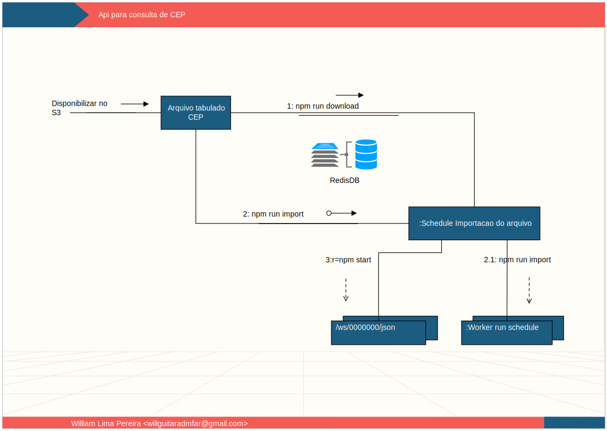

[](https://travis-ci.org/cepninja/api)

# CEP Ninja
É um projeto público de busca de CEP

Colabore


## Serviços
```
docker-compose -f docker/services/docker-compose.yml up -d
```
## Rodar local
Para rodar localmente é necessário adicionar um registro no /etc/hosts
```
sudo sed -i '1 i\127.0.0.1 elastichsearch' /etc/hosts 
```
## Import
```
npm run download
npm run import
```



